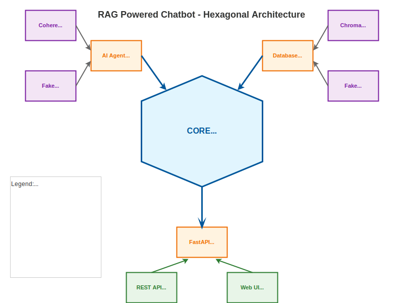

# RAG Powered Chatbot

This is an AI-driven customer support assistant that leverages Retrieval-Augmented Generation (RAG) to provide accurate, context-aware answers to user queries. The chatbot combines a vector database for document retrieval with advanced language models to deliver helpful, up-to-date responses based on your organization’s knowledge base.

This project is designed following the principles of [hexagonal architecture (ports and adapters)](https://alistair.cockburn.us/hexagonal-architecture/), which promotes separation of concerns, testability, and flexibility by decoupling the core business logic from external systems and frameworks.

Built with FastAPI and modern Python libraries, it is designed for easy deployment, extensibility, and robust performance in real-world customer service scenarios.




## Environment Configuration

To configure the chatbot, create a `.env` file in the project root. This file is used to store environment variables such as API keys and database settings. Example:

```
COHERE_API_KEY=your-cohere-api-key
CHROMA_SERVER_HOST=localhost
CHROMA_SERVER_PORT=8000
```

- `COHERE_API_KEY`: Your Cohere API key for embeddings and language models.
- `CHROMA_SERVER_HOST` and `CHROMA_SERVER_PORT`: Host and port for the Chroma vector database server.
If `CHROMA_SERVER_HOST` is not specified it will use the in-memory database.

## Running the Chroma Server Locally

If you want to use the Chroma server database, you need to run the Chroma server locally. You can do this with Docker:

```bash
uv run chroma run --path ./db_chroma --port <PORT>
```

This will start the Chroma server on `localhost:<PORT>`. Make sure your `.env` file matches these settings.


## How to run it

Before using the project, ensure you have:

- [git](https://git-scm.com/book/en/v2/Getting-Started-Installing-Git)
- [uv](https://docs.astral.sh/uv/getting-started/installation/)

correctly installed on your machine.

You can clone the project to your local machine and start developing at your ease by running:
```bash
git clone https://github.com/rag-powered-chatbot.git
```

To run the server in development mode you can use the FastAPI CLI:
```bash
uv run fastapi dev
```
The production mode is:
```bash
uv run fastapi run
```

You can run a command within the virtual environment by prepending `uv run` to the command.
Alternatively, you can activate the environment and then run the command directly.

If you run on a Linux/Mac OS, you can activate the environment with:
```bash
source .venv/bin/activate
```
If you are on a Windows machine, run instead:
```cmd
.venv\Scripts\activate
```

The development environment comes with pre commit hooks installed with the [pre-commit](https://pre-commit.com/) package.

Pre-commit hooks are commands executed right before commiting such as unit tests, formatter, type check etc...
Before using it, make sure your project is tracked by git.

To use you it, install the hooks by running:
```bash
uv run pre-commit install
```

They will then run automatically before each commit.
You can also run the hooks from the command line as:
```bash
uv run pre-commit run
```
