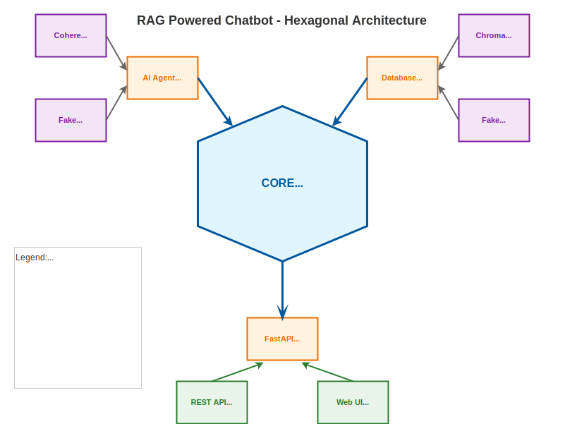

# RAG Powered Chatbot
## 🚀 Live Demo
**Try the application live at: [https://rag.avenueit.be](https://rag.avenueit.be)**


[](https://opensource.org/licenses/MIT)

A modern AI-driven customer support assistant that leverages Retrieval-Augmented Generation (RAG) to provide accurate, context-aware responses. Built with FastAPI and following hexagonal architecture principles for maintainability and testability.



## Features

- **RAG-Powered Responses**: Combines document retrieval with AI generation for accurate, context-aware answers
- **Hexagonal Architecture**: Clean separation of concerns with pluggable interfaces for agents and databases
- **Vector Database**: ChromaDB integration for efficient similarity search and document retrieval
- **AI Integration**: Cohere Command-R-Plus model for natural language generation
- **Real-time Chat**: FastAPI-powered REST API with streaming support
- **Document Management**: Upload and manage knowledge base documents (max 100KB per file)
- **Modern Web UI**: NiceGUI-powered reactive interface with real-time updates
- **Session Isolation**: Per-user document storage with cookie-based sessions (30-day persistence)
- **Testing**: Comprehensive test suite with mock implementations
- **Development Tools**: Pre-commit hooks, linting, and type checking

## Architecture Overview

The application follows hexagonal architecture principles with clear separation between core business logic and external adapters:

### Core Components

- **Interfaces** (`app/interfaces/`): Abstract contracts defining behavior
  - `AIAgentInterface`: Contract for AI agents (query_with_context, get_stream_response)
  - `DatabaseManagerInterface`: Contract for vector databases (add_text_to_db, get_context, etc.)

- **Implementations**:
  - **Agents** (`app/agents/`): AI agent implementations
    - `CohereAgent`: Production implementation using Cohere's Command-R-Plus model
    - `FakeAgent`: Mock implementation for testing
  - **Databases** (`app/databases/`): Vector database implementations
    - `ChromaDatabase`: Production implementation using ChromaDB with Cohere embeddings
    - `FakeDatabase`: Mock implementation for testing

- **Controller** (`app/controller/controller.py`): Business logic orchestration
- **API Layer** (`app/api/`): FastAPI routers and HTTP handling
- **UI Layer** (`app/ui/`): NiceGUI pages and components
  - `pages/chat.py`: Real-time chat interface with streaming responses
  - `pages/documents.py`: Document upload and database management

## Quick Start

### Prerequisites

- Python 3.12 or higher
- [uv](https://docs.astral.sh/uv/getting-started/installation/) package manager
- [Git](https://git-scm.com/book/en/v2/Getting-Started-Installing-Git)

### Installation

1. Clone the repository:
```bash
git clone https://github.com/giunio-prc/rag-powered-chatbot
cd rag-powered-chatbot
```

2. Install dependencies:
```bash
uv install
```

3. Install pre-commit hooks:
```bash
uv run pre-commit install
```

4. Create environment configuration:
```bash
cp .env.example .env
```

5. Edit `.env` file with your API keys:
```env
COHERE_API_KEY=your-cohere-api-key-here
# Optional: External Chroma server settings
CHROMA_SERVER_HOST=localhost
CHROMA_SERVER_PORT=8001
```

### Running the Application

#### Development Mode (with auto-reload):
```bash
uv run fastapi dev
```

#### Production Mode:
```bash
uv run fastapi run
```

The application will be available at `http://localhost:8000`

## Environment Configuration

Create a `.env` file in the project root with the following variables:

| Variable | Required | Description |
|----------|----------|-------------|
| `COHERE_API_KEY` | Yes | Your Cohere API key for embeddings and language models |
| `CHROMA_SERVER_HOST` | No | Host for external Chroma server (defaults to in-memory) |
| `CHROMA_SERVER_PORT` | No | Port for external Chroma server |
| `NICEGUI_STORAGE_SECRET` | No | Secret key for NiceGUI session storage (defaults to built-in key) |

## Development

### Running Chroma Server Locally (Optional)

To use an external Chroma server instead of in-memory database:

```bash
uv run chroma run --path ./db_chroma --port 8001
```

Update your `.env` file accordingly:
```env
CHROMA_SERVER_HOST=localhost
CHROMA_SERVER_PORT=8001
```

### Development Commands

#### Code Quality
```bash
# Run linting with auto-fix
uv run ruff check --fix

# Run type checking
uv run mypy

# Run pre-commit hooks manually
uv run pre-commit run
```

#### Testing
```bash
# Run tests
uv run pytest

# Run tests with coverage
uv run pytest --cov

# Run specific test file
uv run pytest tests/controller/test_controller.py
```

### Project Structure

```
app/
├── agents/              # AI agent implementations
├── api/                 # FastAPI routers and endpoints
├── controller/          # Business logic orchestration
├── databases/           # Vector database implementations
├── interfaces/          # Abstract base classes
├── ui/                  # NiceGUI pages and components
│   ├── pages/           # Page implementations (chat, documents)
│   └── components/      # Reusable UI components
├── middleware.py        # Session cookie middleware
└── main.py             # FastAPI application entry point

static/                 # Static assets (favicon, images)
tests/                  # Test suite mirroring app structure
docs/                   # Sample documents for testing
db_chroma/              # ChromaDB storage (when using persistent mode)
```

## API Endpoints

### Chat Endpoints
- `POST /query` - Send a query and get response
- `POST /query-stream` - Send a query and get streaming response (SSE)

### Document Management
- `POST /add-document` - Upload document to knowledge base (max 100KB, .txt only)
- `GET /get-vectors-data` - Get database statistics (vector count, longest vector)
- `DELETE /empty-database` - Clear all documents for current session

### Web Interface (NiceGUI)
- `GET /` - Chat interface with real-time streaming responses
- `GET /documents` - Document upload, statistics, and database management

## Technology Stack

- **FastAPI**: Modern, fast web framework for building APIs
- **NiceGUI**: Python-based reactive web UI framework
- **LangChain**: Framework for developing applications with large language models
- **ChromaDB**: Open-source embedding database for vector similarity search
- **Cohere**: AI platform providing embeddings and language generation models
- **Ruff**: Fast Python linter and code formatter
- **pytest**: Testing framework with asyncio support
- **uv**: Modern Python package management

## Testing Strategy

- **Unit Tests**: Located in `tests/` directory mirroring `app/` structure
- **Mock Implementations**: `FakeAgent` and `FakeDatabase` for isolated testing
- **Test Data**: Sample documents in `tests/data/`
- **Async Support**: Tests support FastAPI's async operations
- **Coverage**: Use `pytest --cov` for coverage reports

## Contributing

1. Ensure all tests pass: `uv run pytest`
2. Run code quality checks: `uv run ruff check --fix`
3. Pre-commit hooks will run automatically before commits
4. Follow the existing code structure and patterns
5. Add tests for new functionality

## Support

For questions, issues, or contributions, please contact:

- **Author**: Giunio De Luca
- **GitHub**: Open an issue in this repository for bugs or feature requests
- **Email**: giuniodl@live.it

For technical support:
1. Check existing GitHub issues first
2. Create a new issue with detailed information about your problem
3. Include relevant logs and environment details when reporting bugs
